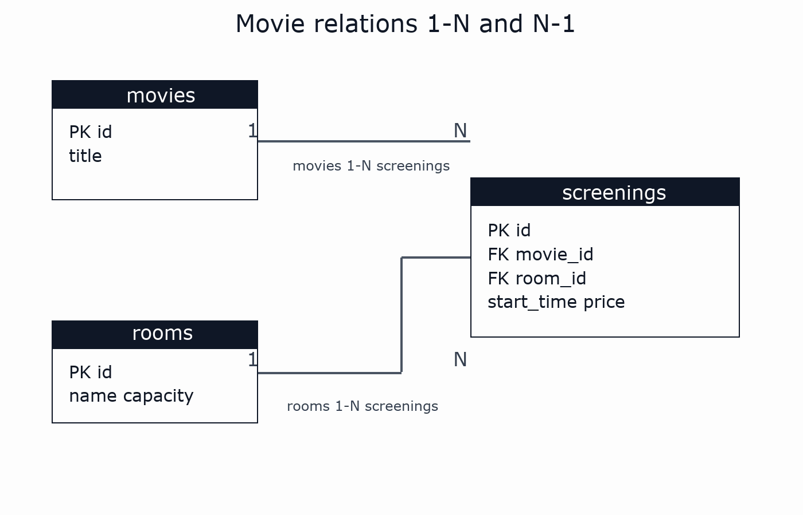
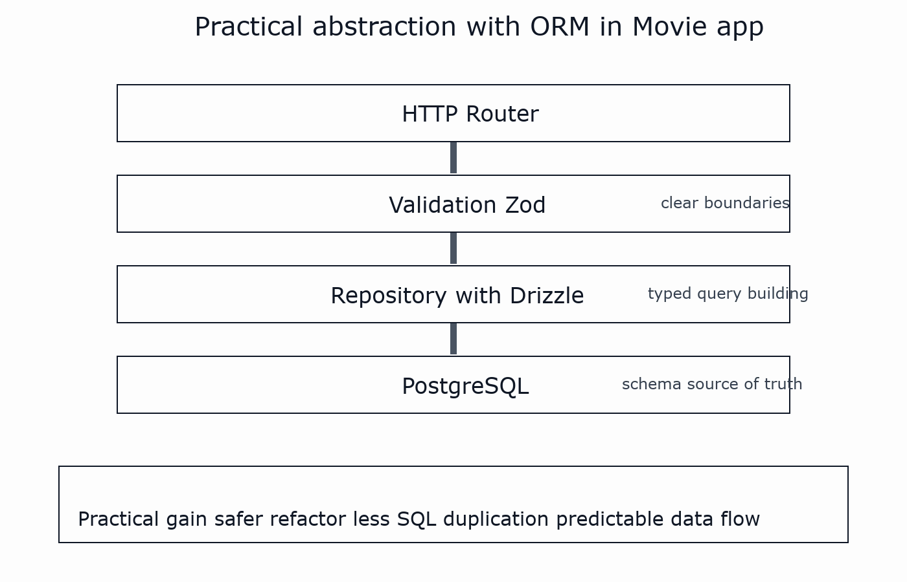

# 14 — Drizzle ORM
## Évolution du TP Movie (sans casser l'architecture)

---

# Objectif du chapitre

- Partir du TP Movie actuel (PG + repositories)
- Introduire Drizzle progressivement
- Garder `Domain / Infrastructure / router`
- Migrer les requêtes SQL vers Drizzle

---

# Mini intro historique (ORM)

Repères rapides :
- années 2000 : forte adoption des ORM (Hibernate, ActiveRecord, Doctrine)
- problème visé : éviter le “tout SQL string” dispersé
- idée : mapper tables/relations vers un modèle manipulable en code

Aujourd'hui :
- certains ORM sont très abstraits
- Drizzle est plutôt **SQL-first** et garde le contrôle SQL

---

# Pourquoi utiliser un ORM ici ?

Dans une app comme TP Movie, un ORM apporte :
- typage fort entre DB et TypeScript
- requêtes composables sans concaténation fragile
- moins d'erreurs de colonnes/champs renommés
- migrations et schéma versionnés (quand on active `drizzle-kit`)

Mais :
- un ORM ne remplace pas la modélisation SQL
- il faut toujours comprendre vos relations en base

---

# Relations SQL dans notre contexte

Tables :
- `movies`
- `rooms`
- `screenings`

Relations :
- `movies (1) -> (N) screenings` via `screenings.movie_id`
- `rooms (1) -> (N) screenings` via `screenings.room_id`

Inverse :
- chaque `screening` appartient à **un** `movie` et **une** `room` (`N -> 1`)

---

# Schéma visuel des relations



---

# Traduction pratique dans les endpoints

`GET /movies`
- lit la table `movies` seule

`GET /movies/:id/screenings`
- lit `screenings`
- joint `rooms` pour enrichir la réponse
- filtre sur la FK `movie_id`

Le design REST reflète directement le modèle relationnel.

---

# Drizzle et les relations (techniquement)

Niveau 1 (déjà suffisant dans le TP) :
- requêtes explicites avec `innerJoin(...)`

Niveau 2 (optionnel) :
- déclarer les relations Drizzle (`relations(...)`) pour une API encore plus guidée

Les deux approches sont correctes ; on commence par le niveau 1.

---

# Abstraction ORM (vue pratique)



---

# Pourquoi cette abstraction aide vraiment ?

- vous gardez des frontières nettes (`router`, validation, DB)
- vous réduisez la duplication de SQL string dans l'app
- vous refactorez plus vite (types + schéma)
- vous gardez un flux de données prévisible pour l'équipe

But concret :
> accélérer le développement sans perdre la lisibilité SQL.

---

# Point de départ du TP Movie

Le TP actuel :
- `router.ts` gère HTTP
- `MovieRepository` et `ScreeningRepository` font le SQL
- `pg.Pool` gère la connexion

Bonne nouvelle : on garde cette structure.

---

# Ce qui change avec Drizzle

- On ajoute un schéma typé (`schema.ts`)
- On crée un client Drizzle (`drizzle.ts`)
- On réécrit les repositories avec `db.select(...)`
- Le `router` ne change presque pas

But : faire évoluer le TP, pas le réécrire.

---

# Installer Drizzle (dans `starter/`)

```bash
npm i drizzle-orm
npm i -D drizzle-kit
```

---

# `Infrastructure/schema.ts` (aligné TP Movie)

```ts
import { pgTable, serial, text, integer, date, timestamp, numeric } from "drizzle-orm/pg-core";

export const movies = pgTable("movies", {
  id: serial("id").primaryKey(),
  title: text("title").notNull(),
  description: text("description"),
  durationMinutes: integer("duration_minutes").notNull(),
  rating: text("rating"),
  releaseDate: date("release_date"),
});

export const rooms = pgTable("rooms", {
  id: serial("id").primaryKey(),
  name: text("name").notNull(),
  capacity: integer("capacity").notNull(),
});

export const screenings = pgTable("screenings", {
  id: serial("id").primaryKey(),
  movieId: integer("movie_id").notNull(),
  roomId: integer("room_id").notNull(),
  startTime: timestamp("start_time").notNull(),
  price: numeric("price", { precision: 6, scale: 2 }).notNull(),
});
```

---

# `Infrastructure/drizzle.ts`

```ts
import { drizzle } from "drizzle-orm/node-postgres";
import { pool } from "./DB.js";

export const db = drizzle(pool);
```

On réutilise le `Pool` existant du TP.

---

# Migration repository `MovieRepository`

Avant (SQL brut) :
- `pool.query(...)`

Après (Drizzle) :

```ts
import { asc } from "drizzle-orm";
import { db } from "./drizzle.js";
import { movies } from "./schema.js";

const items = await db
  .select()
  .from(movies)
  .orderBy(asc(movies.id));

return items;
```

---

# Migration repository `ScreeningRepository`

```ts
import { eq, asc } from "drizzle-orm";
import { db } from "./drizzle.js";
import { screenings, rooms } from "./schema.js";

const rows = await db
  .select({
    id: screenings.id,
    movieId: screenings.movieId,
    startTime: screenings.startTime,
    price: screenings.price,
    roomId: rooms.id,
    roomName: rooms.name,
    roomCapacity: rooms.capacity,
  })
  .from(screenings)
  .innerJoin(rooms, eq(rooms.id, screenings.roomId))
  .where(eq(screenings.movieId, movieId))
  .orderBy(asc(screenings.startTime));
```

Puis on mappe vers le type `Screening` du Domain.

---

# Optionnel : déclarer les relations Drizzle

```ts
import { relations } from "drizzle-orm";

export const moviesRelations = relations(movies, ({ many }) => ({
  screenings: many(screenings),
}));

export const screeningsRelations = relations(screenings, ({ one }) => ({
  movie: one(movies, { fields: [screenings.movieId], references: [movies.id] }),
  room: one(rooms, { fields: [screenings.roomId], references: [rooms.id] }),
}));
```

Utile surtout quand l'app grossit (queries relationnelles plus riches).

---

# Et le router dans tout ça ?

Le router reste identique :
- `GET /movies`
- `GET /movies/:id/screenings`
- mêmes codes HTTP

On change surtout l'Infrastructure.

---

# Migrations Drizzle : quand les introduire ?

Deux stratégies :
- TP court : garder `schema.sql` manuel (simple)
- TP évolué : introduire `drizzle-kit` + migrations versionnées

Le cours recommande stratégie 1 puis 2.

---

# Plan d'évolution concret (TP)

1. garder routes GET actuelles
2. basculer les repositories en Drizzle
3. valider que les réponses JSON ne changent pas
4. seulement après, ajouter de nouveaux endpoints

---

# Pattern de structure conseillé

- `Infrastructure/DB.ts` : `Pool`
- `Infrastructure/schema.ts` : tables Drizzle
- `Infrastructure/drizzle.ts` : client Drizzle
- `Infrastructure/*Repository.ts` : accès données
- `server.ts` : HTTP routing
- `router.ts` : routes API

Même architecture, outil de DB amélioré.

---

# À retenir

- Drizzle s'intègre sans casser le TP Movie
- priorité : migrer l'Infrastructure proprement
- ensuite : faire évoluer l'API avec les verbes REST
