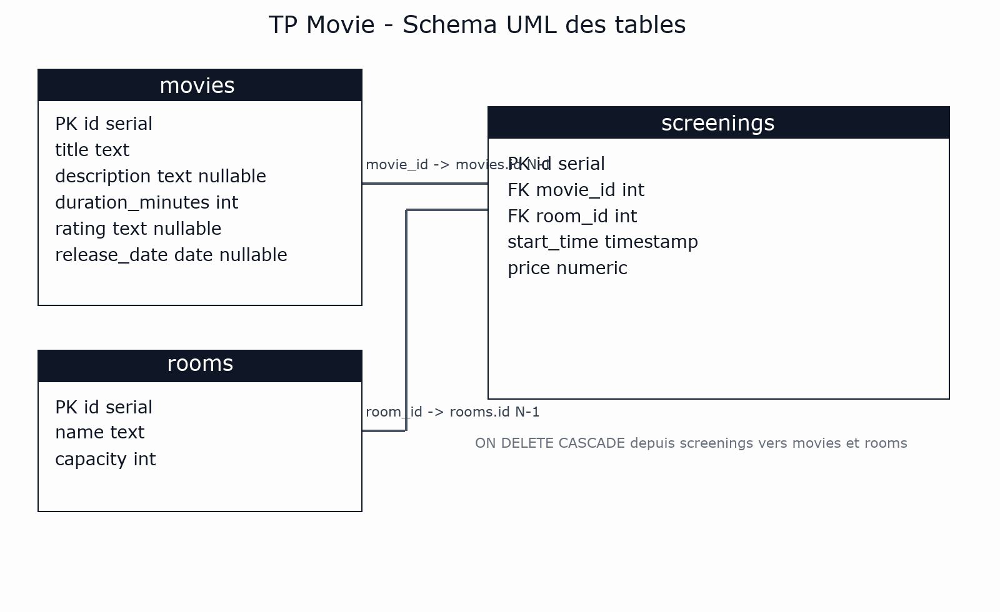

# TP Movie — API Films & Seances (Node 24 + TypeScript + PostgreSQL)

Ce TP consiste a construire une mini API HTTP qui expose :
- la liste des films
- les seances d'un film

Objectif pedagogique : travailler une architecture simple, lisible, et proche d'une vraie app avec separation **Domain / Infrastructure / Router**.

```txt
# Commentaire: structure cible pour demarrer rapidement (version simple 2e annee)
TPs/Movie/
  Domain/
    Movie.ts
    Screening.ts
  Infrastructure/
    DB.ts
    MovieRepository.ts
    ScreeningRepository.ts
  router.ts
  server.ts
  schema.sql
```

## Prerequis

- Node.js 24
- Docker + Docker Compose
- VS Code (recommande)

## Contexte technique

Ce TP se base sur :
- `node:http` (serveur HTTP natif)
- `pg` (PostgreSQL)
- TypeScript strict

Les donnees viennent d'une base PostgreSQL initialisee par `TPs/Movie/schema.sql`.

## Regle importante (a respecter)

**Partie 1 obligatoire : sans Drizzle.**

Pendant cette premiere partie, vous utilisez uniquement :
- `pg.Pool`
- des repositories SQL parametrises
- un `router.ts` simple
- `zod` pour valider les frontieres runtime

Drizzle est une evolution optionnelle en Partie 2.

## Structure imposee

Vous travaillez dans `TPs/Movie/` avec :

- `Domain/`
  - `Movie.ts`
  - `Screening.ts`
- `Infrastructure/`
  - `DB.ts`
  - `MovieRepository.ts`
  - `ScreeningRepository.ts`
- `router.ts`
- `server.ts`
- `schema.sql`

Regle : **pas de SQL dans le router ni dans server.ts**. Le SQL reste dans `Infrastructure/*Repository.ts`.

## Schema UML (tables + relations)



## Mise en route (mode application)

1. Lancer les conteneurs :

```bash
cd starter
docker compose up --build -d
```

La base est creee automatiquement au demarrage du service Postgres via :
- `starter/docker-compose.yml`
- variable `POSTGRES_DB: db`

2. Inserer schema + donnees (commande unique) :

```bash
docker exec -i db-postgres-movie psql -U postgres -d db < TPs/Movie/schema.sql
```

3. Verifier rapidement en SQL :

```bash
docker exec -it db-postgres-movie psql -U postgres -d db -c "\\dt"
docker exec -it db-postgres-movie psql -U postgres -d db -c "select count(*) as movies_count from movies;"
docker exec -it db-postgres-movie psql -U postgres -d db -c "select id, title from movies order by id asc;"
docker exec -it db-postgres-movie psql -U postgres -d db -c "select s.id, s.movie_id, r.name as room_name, s.start_time, s.price from screenings s join rooms r on r.id = s.room_id order by s.id asc;"
```

4. Lancer l'API (depuis `starter/`) :

```bash
npm run dev
```

L'API est exposee sur `http://localhost:3001`.

## Plan de realisation conseille (Partie 1)

1. Completer les types Domain.
2. Completer `Infrastructure/DB.ts` (connexion `Pool`).
3. Completer `MovieRepository.list()`.
4. Completer `ScreeningRepository.listByMovieId(movieId)`.
5. Completer `router.ts` avec `sendJson`, `sendError`, validations, et routes.
6. Brancher le router dans `server.ts`.
7. Tester au fur et a mesure avec `curl`.

##  Domain : types a definir

### `Domain/Movie.ts`

Type attendu :
- `id: number`
- `title: string`
- `description: string | null`
- `durationMinutes: number`
- `rating: string | null`
- `releaseDate: string | null`

### `Domain/Screening.ts`

Type attendu :
- `id: number`
- `movieId: number`
- `startTime: string`
- `price: number`
- `room: { id: number; name: string; capacity: number }`

##  Infrastructure : connexion PostgreSQL

Dans `Infrastructure/DB.ts`, creer un `Pool` avec les variables :
- `DB_HOST`, `DB_PORT`, `DB_USER`, `DB_PASSWORD`, `DB_NAME`

Exemple court :

```ts
import { Pool } from "pg";

export const pool = new Pool({
  host: process.env.DB_HOST,
  port: Number(process.env.DB_PORT),
  user: process.env.DB_USER,
  password: process.env.DB_PASSWORD,
  database: process.env.DB_NAME,
});
```

Exemple de requete `pg` pour demarrer vite :

```ts
const result = await pool.query<{ now: string }>("select now() as now");
console.log(result.rows[0]?.now);
```

##  Validation : mini exemple Zod (court)

Ne pas utiliser Zod dans les repositories SQL.

Exemple simple dans `config.ts` :

```ts
import { z } from "zod";

export const EnvSchema = z.object({
  DB_HOST: z.string().min(1),
  DB_PORT: z.coerce.number().int().positive(),
  DB_USER: z.string().min(1),
  DB_PASSWORD: z.string().min(1),
  DB_NAME: z.string().min(1),
});
```

Exemple court dans `router.ts` (optionnel au debut) :

```ts
import { z } from "zod";

const MovieIdSchema = z.coerce.number().int().positive();
const parsed = MovieIdSchema.safeParse(segments[1]);
if (!parsed.success) return sendError(res, 400, "Invalid movie id");
```

##  Infrastructure : repositories

### `MovieRepository.list()`

But : retourner tous les films tries par `id`.

Exemple SQL (idee) :

```sql
select
  id,
  title,
  description,
  duration_minutes as "durationMinutes",
  rating,
  release_date::text as "releaseDate"
from movies
order by id asc;
```

### `ScreeningRepository.listByMovieId(movieId)`

But : retourner les seances d'un film + infos de salle (`rooms`).

Exemple SQL (idee) :

```sql
select
  s.id,
  s.movie_id as "movieId",
  s.start_time::text as "startTime",
  s.price::float8 as "price",
  r.id as "roomId",
  r.name as "roomName",
  r.capacity as "roomCapacity"
from screenings s
join rooms r on r.id = s.room_id
where s.movie_id = $1
order by s.start_time asc;
```

Important : toujours parametrer les entrees utilisateur (`$1`).

##  Router : routes HTTP (avec exemples courts)

Routes minimales a implementer :
- `GET /health` -> `{ ok: true }`
- `GET /movies` -> `{ ok: true, items: Movie[] }`
- `GET /movies/:id/screenings` -> `{ ok: true, items: Screening[] }`
- alias optionnel : `GET /movies/:id/seances`

### Typage attendu pour le router

Objectif : **zero `any`** et signatures explicites.

```ts
import type { IncomingMessage, ServerResponse } from "node:http";
import type { Pool } from "pg";
import type { MovieRepository } from "./Infrastructure/MovieRepository.js";
import type { ScreeningRepository } from "./Infrastructure/ScreeningRepository.js";

type RouterDeps = {
  pool: Pool;
  movies: MovieRepository;
  screenings: ScreeningRepository;
};

export async function router(
  req: IncomingMessage,
  res: ServerResponse,
  deps: RouterDeps
): Promise<void> {
  // ...
}
```

### Helpers JSON (dans `router.ts`)

```ts
function sendJson(res: ServerResponse, status: number, data: unknown): void {
  res.writeHead(status, { "content-type": "application/json; charset=utf-8" });
  res.end(JSON.stringify(data));
}

function sendError(res: ServerResponse, status: number, message: string): void {
  sendJson(res, status, { ok: false, error: message });
}
```

### Parsing de route (idee)

```ts
const method = req.method ?? "GET";
const [path] = (req.url ?? "/").split("?", 2);
const segments = (path ?? "/").split("/").filter(Boolean);
```

Vous pouvez aussi typer explicitement :

```ts
const method: string = req.method ?? "GET";
const [path = "/"] = (req.url ?? "/").split("?", 2);
const segments: string[] = path.split("/").filter(Boolean);
```

### Parsing de `movieId` (idee)

```ts
const movieId = Number(segments[1]);
if (!Number.isInteger(movieId) || movieId <= 0) {
  return sendError(res, 400, "Invalid movie id");
}
```

Version plus propre (helper type-safe) :

```ts
function parsePositiveInt(value: string | undefined): number | null {
  const n = Number(value);
  if (!Number.isInteger(n) || n <= 0) return null;
  return n;
}
```

Version avec Zod (recommandee) :

```ts
const parsedMovieId = MovieIdSchema.safeParse(segments[1]);
if (!parsedMovieId.success) {
  return sendError(res, 400, "Invalid movie id");
}
const movieId = parsedMovieId.data;
```

### Exemple de branche de route

```ts
if (method === "GET" && path === "/movies") {
  const items = await movies.list();
  return sendJson(res, 200, { ok: true, items });
}
```

Erreurs a gerer :
- `400` : id invalide
- `404` : route inconnue
- `500` : erreur serveur (message generique)

Conseil typing : faire retourner `Promise<void>` au router et `void` aux helpers `sendJson/sendError`.

##  `server.ts` : brancher le router

Role de `server.ts` : instancier les repos et deleguer au router.

Exemple court :

```ts
const movies = new MovieRepository(pool);
const screenings = new ScreeningRepository(pool);

const server = createServer(async (req, res) => {
  await router(req, res, { pool, movies, screenings });
});
```

## Tests manuels (curl)

```bash
curl -s http://localhost:3001/health
curl -s http://localhost:3001/movies
curl -s http://localhost:3001/movies/1/screenings
```

Tests erreur utiles :

```bash
curl -s http://localhost:3001/movies/abc/screenings
curl -s http://localhost:3001/unknown
```

## Critere de validation (Partie 1)

- structure des fichiers respectee
- SQL uniquement dans les repositories
- Zod utilise pour `env` + entrees `router`
- endpoints GET fonctionnels
- retours JSON coherents
- aucun `any`

---

## Partie 2 (optionnelle) : evolution vers Drizzle

Quand la Partie 1 est stable, vous pouvez evoluer sans casser l'architecture.

1. Installer Drizzle :

```bash
npm i drizzle-orm
npm i -D drizzle-kit
```

2. Ajouter :
- `Infrastructure/schema.ts`
- `Infrastructure/drizzle.ts`

3. Migrer les repositories vers Drizzle.

4. Etendre l'API REST :
- `GET /movies/:id`
- `POST /movies`
- `PUT /movies/:id`
- `PATCH /movies/:id`
- `DELETE /movies/:id`
